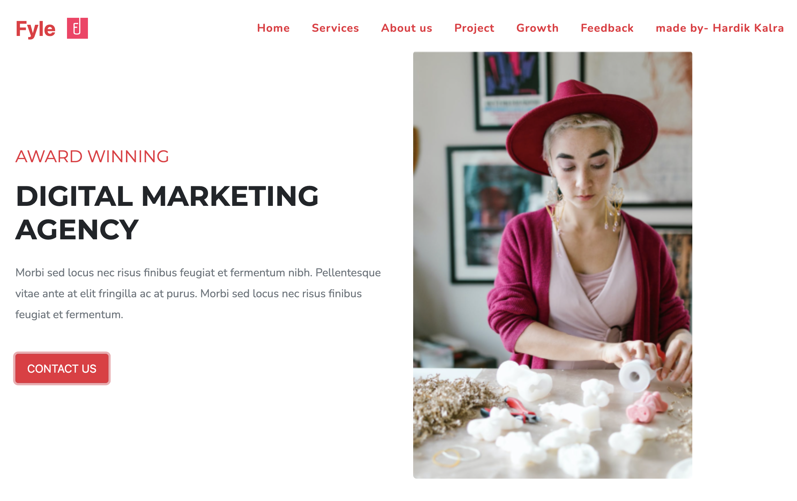
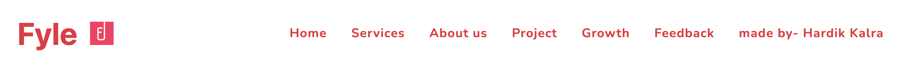
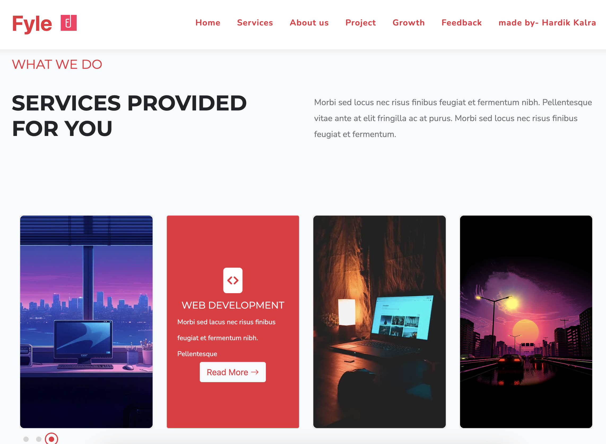

<h2 align="center">
Adobe XD Webpage
</h2>
<h3 align="center" >
Fyle Web Development Assignment
</h3>
<h4 align="center" style="color:gray">
⇩  Webpage preview  ⇩
</h4>

<h4 align="center"><u>
⇩  Added Fyle Navbar as personal customisation  ⇩</u></h4>

<h4 align="center"><u>
⇩  Completed the required tasks   ⇩</u></h4>

<h3><u>
To run the app globally</u></h3>

<h4 style="font-size:12px">Click on this link - https://fyleassignment-five.vercel.app/search</h4>

<h3><u>To run the app locally on your machine</u></h3>

<h4 style="font-size:12px">Follow these steps -</h4>

<li style="font-size:12px">Copy the repository URL</li>
<li style="font-size:12px">Open terminal and navigate to the folder where you want to download the project on you local machine. (like cd desktop)</li>
<li style="font-size:12px">Enter command <b>git clone -copied url- </b> or directly enter <b>git clone https://github.com/hkalra0077/adobe_xd_fyle.git</b></li>
<li style="font-size:12px">Now navigate to the downloaded folder in your system and open <b>index.html </b>file contained in it.</li>
<h4 align="right" style="font-size:12px; color:gray"><i>made by- Hardik kalra</h4>
